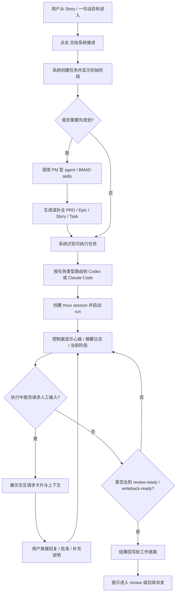
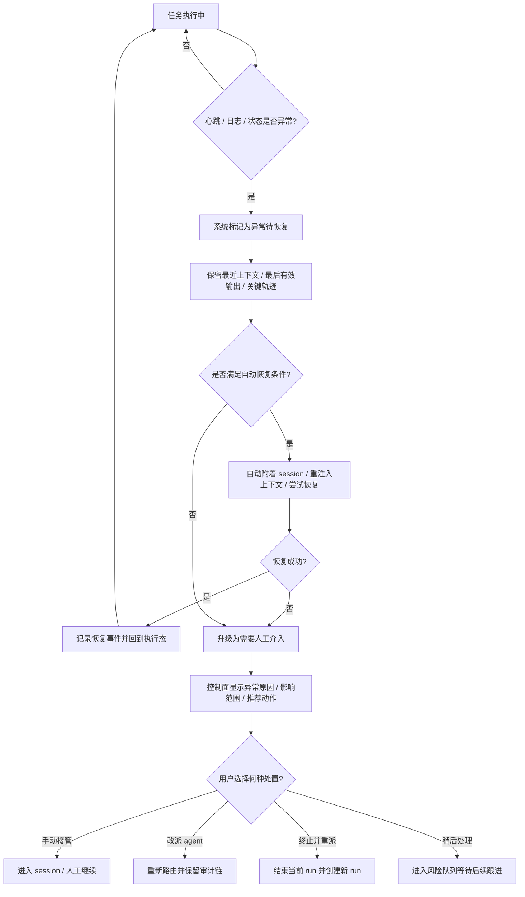
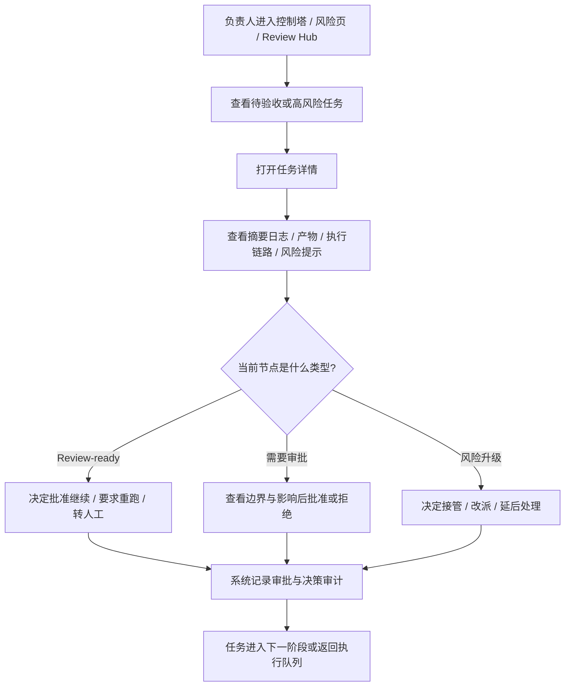

---
stepsCompleted:
  - 1
  - 2
  - 3
  - 4
  - 5
  - 6
  - 7
  - 8
  - 9
  - 10
  - 11
  - 12
  - 13
  - 14
lastStep: 14
inputDocuments:
  - /Users/helay/Documents/GitHub/my-bmad/_bmad-output/planning-artifacts/prd.md
  - /Users/helay/Documents/GitHub/my-bmad/_bmad-output/planning-artifacts/prd-validation-report.md
  - /Users/helay/Documents/GitHub/my-bmad/_bmad-output/project-context.md
  - /Users/helay/Documents/GitHub/my-bmad/docs/API.md
  - /Users/helay/Documents/GitHub/my-bmad/docs/GETTING_STARTED.md
  - /Users/helay/Documents/GitHub/my-bmad/docs/LOCAL_FOLDER.md
---

# UX Design Specification my-bmad

**Author:** David
**Date:** 2026-04-04T19:04:00+08:00

---

<!-- UX design content will be appended sequentially through collaborative workflow steps -->

## Executive Summary

### Project Vision

my-bmad 的目标不是做一个额外的 AI 面板或项目管理界面，而是成为一个可委托、可执行、可跟踪、可治理的 AI 驱动研发控制面。用户应能够从一句自然语言目标或既有 BMAD 工件出发，让系统自动完成规划、任务拆解、agent 路由、后台执行、状态追踪、异常恢复与结果回写，在尽量少打断用户的前提下持续推进研发工作。

从 UX 角度，这意味着产品必须把原本分散在 PRD、Story、终端、AI 对话、日志、审批与回写中的复杂过程，整合为一条可理解、可信任、可接管的连续体验。理想体验不是“用户学会更多工具”，而是“用户把工作交给系统后，系统真的在持续推进，而且每个关键状态都说得清”。

### Target Users

my-bmad 的首要用户包括三类。第一类是独立开发者或个人操作者，他们希望从一句目标或一个 Story 直接发起任务，不想在规划工具、终端和 AI 编码工具之间来回切换，更希望系统默认积极推进并在必要时才请求输入。第二类是小团队负责人、Tech Lead、项目管理员或 Product/Planner 角色，他们关心的不只是任务有没有开始，而是任务如何被路由、是否符合治理边界、何时需要审批、何时进入 review、风险是否被及时暴露。第三类是支持、排障或平台工程角色，他们需要从任务、agent run、`tmux` session、日志、心跳、审计和回写链路中快速定位问题并低成本接管。

这些用户整体具备中高技术理解能力，主要工作场景以桌面 Web 为主，依赖鼠标键盘进行高密度信息浏览、筛选、操作与排障。他们对产品的核心期待不是“更炫”，而是“更少调度成本、更强状态透明度、更高执行连续性”。

### Key Design Challenges

第一个关键 UX 挑战，是如何把高度复杂、长时间运行且跨多个对象层级的执行系统，用清晰但不过载的方式呈现给用户。用户需要看懂 PRD、Story、Task、Agent Run、Session、Heartbeat、Artifact、Writeback 之间的关系，但不能被系统内部复杂性淹没。

第二个关键 UX 挑战，是在“前台极简”和“后台严控”之间取得平衡。产品既追求接近 `yolo` 的委托体验，又必须满足团队级治理、审批、审计、权限边界和异常可接管要求。UX 需要让自动化推进显得顺滑，同时始终让边界、风险和责任归属保持可见。

第三个关键 UX 挑战，是如何处理长时间运行任务中的动态交互和异常恢复。系统不能只显示“运行中”，而必须让用户理解当前执行进度、最后有效活动、阻塞点、交互请求、恢复尝试和人工接管路径，否则控制面会失去可信度。

### Design Opportunities

最重要的设计机会，是把“一句话目标到执行推进”的链路做成真正低摩擦的核心体验，让用户在进入系统后能迅速理解当前任务状态、系统下一步动作以及何时需要自己介入。只要这条主链路足够顺畅，my-bmad 就能显著区别于传统项目管理工具和单点 AI coding 工具。

第二个设计机会，是把“可观测性”升级为差异化体验，而不只是运维附属品。通过状态分层、心跳可信度、关键日志摘要、交互请求卡片、恢复轨迹和回写结果展示，产品可以把原本不可见的后台执行转化为用户愿意信任的过程。

第三个设计机会，是为不同角色建立同一执行系统下的差异化视图。个人用户需要快速推进和低打断体验，团队负责人需要治理与验收视角，支持人员需要排障与接管视角。若这些视图能建立在同一事实链路上，产品就能在不割裂心智模型的前提下覆盖个人与团队两类价值。

## Core User Experience

### Defining Experience

my-bmad 的核心体验不是“管理任务”，而是“把一个研发目标安全地交给系统持续推进”。对用户来说，最重要、最频繁、也必须做对的动作，是从一句自然语言目标、一个 Story、一个 Task 或一段既有 BMAD 上下文发起执行，并在一个连续视图中看到系统如何理解目标、如何拆解、如何路由、如何启动、如何运行、何时需要自己介入。

如果这个核心动作被打磨正确，产品的价值会自然成立：用户不需要手工重新组织上下文，不需要在多个工具间追日志，也不需要靠猜测判断任务是否真的在推进。真正应该做到几乎“无脑”的体验，是发起、观察、回应、接管和验收这一整条主链路。

### Platform Strategy

MVP 的核心平台应明确为桌面优先的 Web 控制面，并与同机 self-hosted 执行环境协同工作。主要交互模式应假设用户使用鼠标和键盘，在较大屏幕上查看多层级状态、日志摘要、风险标记、交互请求与审计链路，因此信息架构应优先为桌面密集型操作优化，而不是先为移动端压缩。

平台策略还需要明确三个边界。第一，MVP 不以移动端或原生桌面客户端为重点，移动场景更适合作为只读或轻量响应的补充，而不是主要操作面。第二，系统不需要以离线为核心前提，因为关键价值依赖实时状态、事件同步和执行监督。第三，平台要同时兼顾控制面与执行面的边界表达：用户在 Web 中操作，但应始终明确哪些动作发生在控制面，哪些状态来自本地执行面。

### Effortless Interactions

最应该被做得毫不费力的交互，是从目标或工件快速发起任务。用户输入一句目标或选择一个 Story 后，系统应立刻给出清晰反馈：当前处于哪个阶段、系统正在做什么、下一步预计是什么，而不是把用户扔进一个模糊的“处理中”状态。

第二类必须顺滑的交互，是执行过程中的观察与响应。用户应能够用尽量少的认知负担理解任务状态、最近心跳、关键日志摘要、阻塞原因和交互请求，并在同一上下文里直接回复 agent、批准策略、补充上下文或进入人工接管，而不是跳转多个页面或工具。

第三类应尽量自动化的交互，是系统在后台完成的协调动作，包括默认路由、状态同步、心跳跟踪、失败检测、恢复尝试和结果回写。凡是竞争产品要求用户手工盯盘、手工比对状态、手工确认是否卡住的地方，my-bmad 都应尽量转化为系统自动完成且对用户可见的流程。

### Critical Success Moments

第一个决定体验成败的时刻，是用户第一次发起任务后，在短时间内看到“系统真的接单并开始推进”。从一句目标到首个清晰状态变化、首个心跳或首个可见执行反馈的路径，必须让用户立刻感受到这不是普通待办录入，而是真正的执行启动。

第二个关键时刻，是系统第一次在运行中发起交互请求，而用户能在不丢失上下文的情况下顺利完成回应。如果这一步体验顺畅，用户会真正理解 my-bmad 不是一次性启动器，而是持续在线的执行协调者。

第三个关键时刻，是异常发生后的恢复或接管。用户需要看到系统是否已检测到问题、是否尝试恢复、为什么升级、自己下一步可以怎么做。如果异常时系统仍然信息完整、路径清晰，用户就会建立对平台的长期信任。

第四个关键时刻，是任务第一次进入 review-ready 或结果回写成功时。这个时刻决定用户是否把产品理解为“能推进工作的执行平台”，而不只是“又一个 AI 工作台”。

### Experience Principles

- 委托必须有回音：用户一旦发起任务，系统必须立即给出清晰、可信、逐步推进的反馈。
- 自动化默认前进：能自动完成的步骤尽量自动完成，只有在真正需要判断、授权或补充上下文时才打断用户。
- 状态必须说真话：界面展示的不是安慰性的抽象状态，而是任务真实所处阶段、可信度和阻塞点。
- 所有关键动作都在同一链路中闭环：发起、执行、交互、恢复、接管、验收与回写必须形成统一上下文，而不是分散在多个割裂界面中。
- 复杂性留给系统，清晰感留给用户：底层对象和机制可以复杂，但前台体验必须帮助用户快速判断“现在发生了什么、我要不要介入、接下来会怎样”。

## Desired Emotional Response

### Primary Emotional Goals

my-bmad 最核心的情绪目标，不是让用户感到炫酷，而是让用户感到放心、掌控、高效、可信。当用户把一个研发目标交给系统时，他首先应该感到“这件事已经被接住了”，而不是“我只是又填了一条记录”。随着任务推进，产品应持续强化一种低焦虑的执行感：系统在推进、状态是可信的、风险是可见的、必要时我可以接管。

第二层情绪目标是“生产力被放大”。用户应感受到自己不是在被流程拖住，而是在借助系统把复杂工作安全地下放、持续推进并快速收回结果。对团队负责人而言，这种情绪会表现为“可治理而不失速度”；对支持和排障角色而言，则是“信息充分、接管清楚、不必盲查”。

### Emotional Journey Mapping

在首次接触产品时，用户应感到清晰和有希望：这个系统不是又一个复杂工具，而是一个能真正帮他推进研发工作的控制面。在发起任务的核心时刻，用户应感到果断和轻松，输入目标或选择工件后，马上看到系统接单、拆解和启动的明确反馈。

在任务运行过程中，用户应持续感到被告知而不是被排除在外。最理想的情绪状态不是高频兴奋，而是稳定的信任感：我知道任务做到哪了，我知道系统为什么这样推进，我知道什么时候该我介入。若任务顺利完成，用户应感到成就感与确认感，即“我真的把这段工作交出去了，而且结果可审查、可回写、可继续流转”。

当出现异常时，目标情绪不是掩盖负面感受，而是把“恐慌”转化为“可处理”。系统应让用户在看到问题时仍保持冷静，因为它已经解释了异常位置、恢复动作、当前影响和接下来可选路径。用户再次回到系统时，应感到这是一个持续在线、记得上下文、值得继续委托的工作环境。

### Micro-Emotions

对 my-bmad 来说，最关键的微情绪是以下几组。第一组是信心而不是困惑：用户在看到任务、run、session、日志和回写状态时，应始终能快速理解它们的关系。第二组是信任而不是怀疑：界面不能给出模糊安慰式状态，而要给出真实、可追溯、可验证的状态表达。第三组是低焦虑而不是高压盯盘：长时间运行任务不应迫使用户不断手工检查终端或重复刷新多个页面。

第四组是成就感而不是机械满意：当任务进入 review-ready、自动恢复成功或结果顺利回写时，产品应让用户感受到这不仅是一个状态变化，而是一次真实工作被推进完成。第五组是被支持而不是被丢下：当 agent 发起交互请求或系统进入待接管状态时，用户应感觉平台正在协助决策，而不是把问题重新扔回给自己。

### Design Implications

如果我们希望用户感到放心和掌控，UX 必须优先强化状态透明度、执行链路可解释性和关键动作的因果关系。状态标签不能只写“运行中”“失败”，而应补充阶段、可信度、最近活动、阻塞原因和下一步动作。任务详情页必须天然支持用户从当前状态一路追到 run、session、交互请求、恢复记录和结果回写。

如果我们希望用户感到高效和低负担，设计就必须尽量减少上下文切换与重复确认。能在同一界面完成的动作不要分散，能由系统自动完成的动作不要丢给用户手工盯盘。对于长时间运行的执行，应优先展示摘要、异常、风险和需回应项，而不是默认把所有原始信息堆在用户眼前。

如果我们希望用户建立信任，则必须有意识避免几类负面情绪：状态漂移带来的怀疑、异常无解释带来的恐慌、权限边界不清带来的不安、以及交互请求缺乏上下文带来的挫败。对应的设计策略应包括：显式阶段模型、异常解释层、操作审计可见性、接管路径明确化、以及重要动作前后的反馈闭环。

### Emotional Design Principles

- 让用户始终知道系统是否真的在工作，而不是让他们靠猜。
- 用真实透明替代表面顺滑，宁可明确说明异常，也不要制造虚假的稳定感。
- 把复杂执行过程转化为低焦虑体验，减少盯盘感和失控感。
- 让每一次用户介入都带着完整上下文出现，避免“为什么现在要我回答这个”的突兀感。
- 在关键完成时刻强化成就感与确认感，让用户清楚感受到工作被推进了，而不是只看到一个状态标签变化。

## UX Pattern Analysis & Inspiration

### Inspiring Products Analysis

本项目最值得参考的两个产品是 Linear 与 GitHub，但参考方式并不相同。Linear 提供的是极强的任务流、状态清晰度与高密度信息组织能力。它最值得借鉴的，不是单个视觉风格，而是它如何让复杂工作在界面中显得轻、快、准：状态切换明确、列表阅读负担低、信息分层克制、关键动作路径短。这些特征非常适合 my-bmad 在任务、执行链路、风险状态和待响应事项上的表达。

GitHub 则更适合用作工程上下文承载、审查流与可追溯性的参考。它在 Pull Request、Issue、Commit、Check、Review 之间建立了稳定的对象关系，让用户即使面对复杂工程活动，也能沿着证据链理解“发生了什么、为什么发生、接下来该看哪里”。这对 my-bmad 非常重要，因为本产品同样需要在 PRD、Story、Task、Agent Run、Session、Artifact 与 Writeback 之间建立可解释的关系网络。

如果说 Linear 更像“高效的控制界面”，GitHub 更像“完整的工程上下文载体”，那么 my-bmad 的机会就在于把两者优势组合起来：既有 Linear 式的轻快和状态清晰，也有 GitHub 式的追踪深度和证据完整性。

### Transferable UX Patterns

**导航模式方面**，可以借鉴 Linear 的层级克制与工作流优先视图。对于 my-bmad，这意味着首页和项目页不应先展示所有模型对象，而应优先围绕“当前需要关注的工作”组织，比如待启动、执行中、待响应、异常待恢复、待验收等核心队列。与此同时，可以借鉴 GitHub 的对象间跳转方式，让用户从一个 Task 或 Run 自然跳到相关日志、交互请求、回写结果与审计事件，而不是迷失在割裂页面里。

**交互模式方面**，Linear 的快速状态感非常适合迁移到任务与执行状态系统中。状态变化应快速、明确、可预期，并且带有足够上下文。GitHub 的时间线与讨论流模式则适合迁移到执行历史和人工介入记录中，让用户看到系统、agent 与人工之间的连续协作轨迹，而不是零散事件列表。

**视觉模式方面**，Linear 的高密度低噪音界面适合参考到 my-bmad 的任务列表、风险列表和控制面概览；GitHub 的结构化信息块、差异化状态徽标和证据链式组织方式，则适合参考到详情页、审计页和 review-ready 结果页。对 my-bmad 来说，视觉重点不应是“装饰”，而是帮助用户更快看懂系统真实状态。

### Anti-Patterns to Avoid

第一类需要避免的反模式，是很多项目管理工具常见的“只有管理、没有执行”的空心状态。界面上看似有很多卡片和字段，但用户无法据此判断系统是否真的推进了工作。对 my-bmad 来说，任何只展示名义状态、不展示执行证据、最近活动或下一步动作的界面，都属于应避免的反模式。

第二类需要避免的反模式，是工程工具中常见的“信息齐全但认知过载”。如果把日志、心跳、交互请求、恢复动作、回写结果、审计事件全部同权平铺，用户会立刻失去判断重点。my-bmad 必须避免把底层复杂性原样抛给用户，而应先给摘要、分层和优先级，再允许深入展开。

第三类需要避免的反模式，是把自动化做成黑箱。若用户只能看到“运行中”，却不知道系统在做什么、为何停住、是否需要自己介入，就会迅速失去信任。my-bmad 应避免任何掩盖风险、模糊阶段或隐藏异常解释的设计。

### Design Inspiration Strategy

**应直接吸收的部分**，包括 Linear 对状态表达、信息密度与关键路径压缩的处理方式，以及 GitHub 对对象关系、时间线、工程证据链和审查上下文的组织方式。这些模式都直接支持 my-bmad 的核心目标：让复杂执行系统保持可见、可懂、可接管。

**应改造后吸收的部分**，包括 Linear 式的任务视图与 GitHub 式的详情页结构。my-bmad 不能照搬任何一方，因为它既不是纯任务工具，也不是纯代码托管工具。它需要把任务管理、执行监控、交互响应、恢复治理和结果回写压缩到一个统一控制面里，因此需要在线性工作流和工程证据链之间建立新的组合式信息架构。

**应明确避免的部分**，包括看起来高效但缺少解释的极简状态设计，以及看起来全面但无法快速决策的复杂工程页面。my-bmad 的灵感策略应是：学习 Linear 的轻快，不复制其语义简化；学习 GitHub 的完整，不复制其信息负担。最终目标是形成一种属于 my-bmad 的控制面语言：任务推进像 Linear 一样干脆，工程上下文像 GitHub 一样可信。

## Design System Foundation

### 1.1 Design System Choice

my-bmad 的设计系统基础选择为**可主题化系统**，并以当前项目已经具备的 `Tailwind CSS + shadcn/ui` 方向作为实施基础。这个选择意味着产品不会在 MVP 阶段追求完全从零自建所有组件，也不会强依赖一套视觉语言过强、难以塑造差异化的现成体系，而是基于稳定、可扩展、可定制的组件基础，逐步沉淀出属于 my-bmad 的控制面语言。

对本项目来说，这一选择尤其合适，因为产品既需要桌面优先的高密度控制面，也需要长期演进出独特的任务、执行、日志、风险和接管视图。可主题化系统既能保证首期实现速度，又不会把后续体验演进锁死在第三方体系的默认表达里。

### Rationale for Selection

第一，这个方向最符合 my-bmad 当前“速度与独特性平衡”的现实需求。MVP 需要快速形成可用控制面，但又不能只是一个通用后台模板，因为本产品有非常强的执行编排、状态机、心跳、交互请求和审计语义。可主题化系统允许我们先站在成熟组件基础上起步，再把真正有产品差异化的界面逐步定制出来。

第二，这个方向与项目现有技术栈天然一致。当前仓库已经采用 Tailwind、shadcn/ui 方向和 Server-First 的前端架构，继续沿用这一基础可以降低实现摩擦、减少迁移成本，也更利于后续把设计规范直接映射到工程实现。

第三，这个方向最适合 Linear 与 GitHub 结合式的灵感策略。my-bmad 需要像 Linear 一样保持界面轻快、状态明确，又要像 GitHub 一样承载较深的工程上下文与对象关系。完全现成体系往往过于模板化，完全自定义又会拖慢首期节奏，而可主题化系统正好能承接这两类目标。

### Implementation Approach

实施上，my-bmad 应采用“基础组件复用 + 关键控制面组件定制”的方式推进。基础交互组件，如按钮、输入框、弹层、下拉、标签、表格基础能力、分页和通用反馈组件，可优先复用现有可主题化体系。与此同时，任务状态条、执行链路时间线、交互请求面板、风险队列、日志摘要视图、异常恢复卡片、回写结果区块等与产品语义强绑定的组件，应视为领域组件而不是通用组件。

在节奏上，建议先建立颜色、层级、状态、间距、密度和反馈方式的核心 token 与界面规则，再围绕控制面主视图逐步收敛复合组件模式。这样既能保证 MVP 的一致性，也能避免在产品尚未稳定前过早做过度设计系统化。

### Customization Strategy

定制策略应采用“外层主题统一、内层领域组件差异化”的方法。也就是说，通用交互层保持统一的颜色 token、边框语义、阴影层级、焦点状态、危险态和成功态表达，以维持整体一致性；而真正体现 my-bmad 差异化的部分，应集中在任务/执行/审计/接管这些业务密度高的复合界面上。

在视觉上，定制目标不是追求装饰性，而是强化可信控制面的识别度：状态必须清楚、风险必须突出、交互请求必须可回应、证据链必须可追。随着产品演进，可以逐步把高频复合模式沉淀为项目自己的控制面组件库，但首期不必为“完全拥有设计系统”而牺牲推进速度。

## 2. Core User Experience

### 2.1 Defining Experience

my-bmad 的定义性体验可以概括为一句话：**把一个研发目标交给系统，系统会自己接住、推进，并在必要时回来找你。** 这不是普通的任务记录，也不是一次性的 AI 聊天，而是一种“委托执行”的核心交互。用户最可能向别人描述的，不是某个按钮或页面，而是“我把 Story 或一句目标扔进去，系统会先规划、再派发、再持续推进，我随时都能看到它做到了哪里”。

如果这件事被做对，my-bmad 的其它体验都会自然跟上。因为用户真正购买的不是更多字段、更大看板或更多 AI 面板，而是把复杂研发工作安全地下放给系统之后，仍能保持掌控感、透明度和接管能力。

### 2.2 User Mental Model

用户当前解决这类问题的方式，通常是把多个工具拼在一起：PRD 或 Story 在一个地方，AI 对话在一个地方，终端和 `tmux` 在一个地方，日志和代码结果在另一个地方，最后还要自己判断任务是否真的推进了。这使他们形成了一种“我必须亲自盯着，系统只会帮一点点”的心理模型。

my-bmad 需要替换这种心理模型，建立新的认知方式：**系统不是助手面板，而是执行控制面。** 用户期待的是像委派给一个持续在线的执行协调者一样工作：我给目标，你先推进；如果需要我，你带着上下文来找我；如果出问题，你告诉我具体问题和可选路径；如果完成了，你把结果回到正确链路里。最容易引发困惑的地方，会是任务状态是否可信、系统是否真的在工作、以及执行链路和工件链路之间的关系是否清楚，因此这些点必须在体验中被直接解释而不是留给用户猜。

### 2.3 Success Criteria

- 用户发起一个目标、Story 或 Task 后，能在极短时间内看到系统已接单、已进入某个明确阶段，并理解下一步会发生什么。
- 用户在执行过程中不需要频繁跳到终端、日志工具或其他系统核实平台是否真的在工作。
- 用户能快速判断当前任务是否顺利、是否卡住、是否需要自己响应，以及如果需要响应，应该做什么。
- 当系统请求补充信息、授权或策略选择时，用户能在完整上下文里完成回应，而不是被突兀打断。
- 当任务完成、进入 review-ready、或成功回写时，用户清楚感受到一次真实工作被推进完成，而不是只看到一个标签变化。

### 2.4 Novel UX Patterns

my-bmad 的核心体验并不是完全陌生的全新交互，而是**把熟悉模式进行新的组合**。它结合了任务工具中的状态流、工程工具中的证据链、终端工作流中的长时间运行语义，以及 AI 工具中的动态对话与补充上下文能力。也就是说，这不是凭空发明一个新手势或新控件，而是把用户原本分散理解的几个模式，整合成一个统一而连贯的委托-执行-观察-接管模式。

这种组合带有一定新颖性，因此需要通过熟悉隐喻来降低理解门槛。最适合的隐喻不是“聊天”，而是“任务控制塔”或“执行控制面”：用户发起任务，系统进入运行；运行状态有阶段、有事件、有证据；需要人工时会回到用户面前；完成后结果回到对应链路。创新点不在控件，而在整条链路的连续性与可信度。

### 2.5 Experience Mechanics

**1. Initiation：** 用户从一句自然语言目标、一个 Story、一个 Task 或某个准备完成的 BMAD 工件开始。界面通过明显入口邀请用户“交给系统推进”，而不是要求用户先理解大量配置。发起后，系统立即返回任务已创建、当前阶段、预计下一步和初始上下文摘要。

**2. Interaction：** 用户核心上只做三类动作：发起、观察、响应。发起时提供目标或选择工件；观察时查看状态、摘要日志、最近活动、风险和交互请求；响应时在原上下文里补充说明、批准策略、选择恢复动作或切换到人工接管。系统在后台负责更多动作，包括规划、路由、启动、心跳追踪、恢复尝试和结果回写。

**3. Feedback：** 系统必须持续提供阶段化反馈，而不是只给一个“运行中”。用户需要看到当前阶段、最近有效活动、最后心跳、关键日志摘要、是否存在阻塞、是否有待响应事项，以及系统预计的下一步。如果出错，反馈必须解释问题层级、当前影响、已尝试动作与接下来可选路径。

**4. Completion：** 用户通过明确结果信号知道任务已经达到阶段性完成，例如 review-ready、回写成功、人工接管完成或本轮执行终止。完成后，系统不仅展示结果，还应指出“下一步是什么”——进入 review、继续派发后续任务、处理残余风险或回到上游工件流。这让完成体验成为工作闭环的一部分，而不是界面上的终点。

## Visual Design Foundation

### Color System

my-bmad 的颜色系统应以现有品牌 logo 中的蓝、青、绿渐变为主识别语言。蓝色部分表达可靠、工程性与控制感；青色部分表达系统流动性、状态同步与智能编排；绿色部分表达推进、完成、成功回写与正向执行结果。这个渐变语义与产品从“规划”到“执行”再到“完成”的叙事高度一致，因此应保留为品牌级强调色，而不是仅作为装饰图形。

在实际 UI 里，颜色系统应采用“中性底 + 品牌强调 + 语义状态”的结构。背景、卡片、边框、分隔和大部分文字继续保持克制的中性色体系，以保证高密度控制面下的可读性与稳定感；品牌渐变主要用于关键品牌识别区、主 CTA、高价值空状态、关键引导区或重要成功时刻；信息、成功、警告、错误则保持清晰独立的语义映射，避免品牌色过度侵入状态判断。

颜色语义建议进一步明确为：主品牌强调偏蓝青，用于主操作、选中态、关键入口和系统当前焦点；成功态偏绿色，用于执行推进、回写成功、健康状态与恢复成功；警告态维持偏黄橙，用于风险、接近阈值、需要关注但尚未失败的状态；错误态维持偏红，用于执行失败、权限拒绝、回写中断和关键异常。品牌色与语义色必须分工明确，不能让“好看”压过“好判断”。

### Typography System

从现有全局样式看，项目已经适合继续走现代、中性、工程感较强的无衬线字体路线。Typography 的核心目标不是品牌姿态炫技，而是保障控制面中的高频扫描效率。整体语气应为专业、冷静、清晰、现代，避免过于活泼或消费化的字体个性，以免削弱执行控制面的可信感。

标题层级应简洁有力，适合快速建立页面与模块结构；正文与表格/列表文本应优先为可读性和密度服务；辅助信息、状态说明、时间戳、路径和日志摘要应使用清楚但不过分抢眼的次级文本层级。代码、命令、路径、工件 ID、session 名称和事件键值等内容可继续使用独立的 monospace 表达，与主阅读文本形成明确分层。

字体层级建议保持少而稳：页面标题、区块标题、卡片标题、正文、辅助信息、代码/元信息六层足够，避免建立过多视觉层级导致控制面复杂度进一步放大。行高应略偏紧凑但不拥挤，以适应桌面优先、高信息密度的使用环境。

### Spacing & Layout Foundation

my-bmad 的布局基础应明确为“高密度但不压迫”的桌面控制面。它不应走极其松散的营销站风格，也不应走过度压缩、让用户难以呼吸的监控台风格。更合适的是建立清晰的节奏型密度：页面区块、卡片、列表、状态行和日志摘要之间保持规律性的留白，让用户在高信息环境中仍能迅速分辨模块边界与操作优先级。

间距系统建议以 8px 为基础节奏，并允许 4px 作为微调单位，用于标签、状态点、图标与文字之间的细部关系。模块之间的主间距应统一，卡片内部的标题、内容、操作和状态区域应形成可复用的间距模式。对于任务列表、风险列表、执行时间线和交互请求面板，应优先强调纵向节奏一致性，让用户在扫描时形成稳定预期。

布局结构上，建议坚持桌面多栏控制面思路：一级导航或侧边导航承载主域切换，中间区域承载列表或主任务流，右侧或下层区域承载详情、日志、交互与辅助上下文。不是所有页面都必须三栏，但整体信息架构应允许“列表-详情-上下文”并置，以减少来回跳转。网格体系可采用 12 栏思路作为响应式基础，但真正的体验重点应放在内容优先级与区域协作上，而不是机械追求栅格形式感。

### Accessibility Considerations

由于本产品面向高频、长时间使用的工程用户，视觉可访问性不能只满足最低标准，而应兼顾疲劳管理与高效识读。首要要求是文本与背景、状态色与背景、边框与表面之间保持足够对比度，尤其在深浅主题切换和细粒度状态标签中，不能仅靠微弱色差表达重要信息。

第二，所有关键状态都不应只依赖颜色表达。执行中、待响应、异常待恢复、已完成、已回写等状态，除了颜色，还应配合文字、图标或位置结构共同表达，以避免颜色感知差异带来的误判。第三，字号、点击目标、焦点态和键盘可达性要服务于控制面实际使用场景，尤其是审批、接管、响应和风险处置类操作，应让用户在压力状态下也能快速准确操作。

最后，考虑到现有项目已经对 reduced motion 有基础照顾，后续视觉强化也应继续避免无意义动画。对于 my-bmad 这类控制面，稳定、即时、可预测的反馈通常比炫目的动效更能建立信任。

## Design Direction Decision

### Design Directions Explored

本轮设计方向探索共覆盖 6 个方向，分别强调不同的控制面表达重点。`Signal-First Control Tower` 聚焦系统信号、整体健康度和待处理事项，强调全局掌控；`Engineer Workspace` 更偏工程工作台心智，强化任务列表、详情页和证据链关系；`Run Timeline Console` 突出长时间运行、恢复路径和执行时间线；`Review Hub` 把 review-ready、验收与治理闭环放在核心位置；`Command Grid` 适合团队级治理与运营总控；`Focus Queue` 则强调个人用户在高频工作中的优先事项处理。

这些方向并不是彼此冲突的候选，而更像围绕同一产品核心的不同重心表达。对 my-bmad 来说，最佳结果不是单纯选择其中一个孤立方向，而是锁定一个主方向，再吸收其他方向里最有价值的结构性优势。

### Chosen Direction

最终建议锁定的主方向为 **Direction 01: Signal-First Control Tower**。它最符合 my-bmad 的核心差异化：用户把工作委托给系统后，最先需要确认的是“系统是否真的在推进”“哪里需要我介入”“当前整体是否健康”，而不是先进入某个局部对象详情。这个方向能最直接建立“放心、掌控、可信”的情绪体验。

在主方向锁定后，建议组合吸收两个补充方向的优势：保留 **Direction 02: Engineer Workspace** 的工程详情结构，用于任务详情页、执行证据链和对象关系视图；吸收 **Direction 03: Run Timeline Console** 的运行时间线表达，用于执行链、恢复链和交互请求的时间序列展示。也就是说，my-bmad 的默认入口用控制塔语言，深入查看时切换到工程工作台和运行时间线语言。

### Design Rationale

选择 Control Tower 作为主方向的原因有三点。第一，它最契合产品的一号价值：让系统持续推进工作，同时让用户始终知道当前发生了什么。第二，它最适合作为个人用户与团队用户共用的第一层界面语言，因为无论角色是谁，首先都关心整体状态、风险和待处理信号。第三，它为后续治理、审批、异常升级、配额与审计等高层能力预留了最自然的位置。

而补充吸收 Engineer Workspace 和 Run Timeline 的原因，则是为了避免主方向过于抽象。my-bmad 不能只有宏观信号，还必须在深入查看时给出足够强的工程上下文与事件证据链。因此最合理的设计策略不是“只选一个页面风格”，而是建立层次化方向：总览看信号，深入看证据，异常时看时间线。

### Implementation Approach

在实现上，建议把 Design Direction Decision 落为三层结构。第一层是默认控制塔首页，用于展示任务健康度、待响应事项、风险队列、关键运行状态和推荐动作。第二层是对象化详情页，以任务、run、session、artifact、writeback 为中心，采用更工程化的信息布局。第三层是时间线与调查视图，用于承载日志摘要、状态漂移、恢复动作、人工介入和关键审计节点。

具体落地时，可以先实现 Direction 01 的整体布局骨架与主导航结构，再逐步为关键详情页引入 Direction 02 的信息块模式，并为执行相关对象引入 Direction 03 的时间线模块。这样既能保持主体验统一，也能让复杂执行系统在深入层面依然清晰、可信、可追溯。

## User Journey Flows

### Journey 1 - 独立开发者从 Story 发起并持续推进执行

这条旅程对应产品最核心的成功路径：用户把一个明确目标或 Story 交给系统后，不再在多个工具之间来回切换，而是在同一个控制面中看到规划、路由、执行、交互请求和回写结果的连续推进。这个流的设计重点是：入口要足够低摩擦、执行反馈要足够快、运行态要足够可信、需要人工响应时要足够顺滑。

这个流的成功标志包括：用户在短时间内看到系统已接单并开始推进；在运行中不需要频繁跳出平台核实状态；交互请求出现时能立即理解背景并完成回应；结果进入 review-ready 时，能清楚看见这是一条完整工作链路的阶段性完成，而不是一个孤立状态更新。

### Journey 2 - 任务异常后自动恢复或升级到人工接管

这条旅程对应产品可信度的关键证明。系统不只是会启动任务，更要在任务卡死、日志断流、心跳中断或回写失败时保持有声、有据、有路径。用户在这个流中最怕的不是失败本身，而是系统沉默、状态失真和接管困难。因此这个流必须把检测、解释、恢复和升级路径做得极其清晰。

这个流的 UX 目标，是把“恐慌”转化为“可处理”。用户在异常时必须立刻知道三件事：出了什么问题、系统已经做了什么、我接下来可以怎么做。只要这三件事始终清楚，平台的可信度就会远高于只能显示“失败”的普通工具。

### Journey 3 - 团队负责人审查、批准与验收执行结果

这条旅程对应团队化场景中的治理闭环。负责人并不需要参与每一步执行，但必须在关键节点迅速判断：这条任务是否值得继续、是否需要重跑、是否应转人工、是否已经达到可验收状态。因此这个流要把摘要、证据、风险和决策动作压缩到一个高信噪比界面中。

在这个流里，最重要的不是展示更多细节，而是让负责人在极短时间内完成“是否继续”的决策。摘要必须可用、关键证据必须近手、风险必须被前置显示、决策动作必须明确区分后果。这样团队治理才不会把自动化变成新的阻塞点。

### Journey Patterns

跨这些旅程，可以沉淀出几类统一模式。**导航模式**上，应始终允许用户在“总览信号 → 对象详情 → 时间线证据”之间自然切换，而不是困在单一视图中。**决策模式**上，所有关键人工介入都应尽量收敛为少数明确动作，例如批准、补充信息、改派、接管、终止、重跑。**反馈模式**上，所有旅程都依赖同一种阶段化状态表达：当前阶段、最近有效活动、风险级别、下一步建议。

另外还有一条很关键的共性：所有高价值流都必须保留上下文连续性。无论是从 Story 发起、异常恢复，还是团队验收，用户都不应在关键节点失去前情信息。平台的统一链路感，是这些旅程能成立的前提。

### Flow Optimization Principles

- 尽量缩短“发起 → 看见系统在工作”的时间，先建立信任，再展示复杂度。
- 把高频决策压缩为少量高置信动作，降低认知负担。
- 所有异常都要附带解释、影响和下一步，而不是只给状态标签。
- 用摘要优先、证据下钻的结构，避免把所有底层信息一次性压给用户。
- 在每条旅程里都明确“成功完成后下一步是什么”，避免用户在阶段终点失去方向。

## Component Strategy

### Design System Components

基于前面已经确定的可主题化系统方向，my-bmad 的基础组件层应尽量复用 `Tailwind + shadcn/ui` 已经擅长的部分。包括按钮、输入框、搜索框、下拉选择、弹层、抽屉、标签、切换器、表格基础结构、分页、提示、空状态、Toast、Tabs、Accordion、Dialog、Popover、Tooltip、Skeleton 和通用表单控件，都可以作为基础层组件直接承接。它们的价值不在于形成产品差异化，而在于提供稳定、可访问、易复用的交互骨架。

但从用户旅程和设计方向可以看出，my-bmad 的真正关键界面并不属于通用后台模板范畴。像任务推进、执行链路、心跳状态、交互请求、异常恢复、回写结果、审批节点、风险升级和审计证据链，这些都带有明确的产品语义，不能只靠通用 Card + Table + Badge 简单拼装。也就是说，设计系统负责“基础语法”，而 my-bmad 需要补齐“控制面语义组件”。

### Custom Components

### Execution Status Rail

**Purpose:** 用于在列表与详情页中持续表达任务或 run 当前所处阶段，以及下一步预计动作。  
**Usage:** 出现在任务列表、任务详情页顶部、运行视图和 Review Hub 中。  
**Anatomy:** 阶段节点、当前高亮阶段、最近活动时间、风险标记、下一步提示。  
**States:** 默认、运行中、待响应、异常待恢复、已完成、已回写、已终止。  
**Variants:** 紧凑列表型、详情页完整型、横向时间线型。  
**Accessibility:** 应为每个阶段提供可读文本，不只依赖颜色；当前阶段应有 `aria-current` 或等价语义。  
**Content Guidelines:** 只显示对当前判断最有价值的阶段，不堆叠无意义历史细节。  
**Interaction Behavior:** Hover 或聚焦可展开查看最近一次阶段变化和原因说明。

### Interaction Request Card

**Purpose:** 把 agent 在运行中发起的提问、授权请求或上下文补充请求，以可直接处理的方式暴露给用户。  
**Usage:** 出现在控制塔首页、任务详情、风险页和 Focus Queue 中。  
**Anatomy:** 请求标题、请求来源、上下文摘要、建议动作、响应输入区、超时或优先级提示。  
**States:** 新请求、处理中、已响应、已过期、已升级。  
**Variants:** 紧凑卡片、内嵌详情模式、批量处理模式。  
**Accessibility:** 必须支持键盘快速聚焦与提交；请求优先级和截止风险必须可被读屏识别。  
**Content Guidelines:** 问题必须附带足够背景，避免让用户不知道“为什么现在问我这个”。  
**Interaction Behavior:** 用户可直接批准、补充说明、驳回、改派或进入人工接管。

### Recovery Timeline Panel

**Purpose:** 用于展示异常检测、自动恢复尝试、升级与人工处置的完整时间链。  
**Usage:** 出现在异常任务详情、支持排障页和审计视图。  
**Anatomy:** 事件时间点、事件类型、影响说明、恢复动作、结果状态、操作建议。  
**States:** 正常监控、异常触发、自动恢复中、恢复成功、恢复失败、等待人工。  
**Variants:** 单 run 模式、跨 run 对比模式。  
**Accessibility:** 时间线节点应可线性阅读；事件状态需有图标与文本双表达。  
**Content Guidelines:** 重点展示因果链与处置结果，而不是所有原始日志。  
**Interaction Behavior:** 支持从某个事件节点直接跳到相关日志、session 或审计详情。

### Evidence Chain Viewer

**Purpose:** 把 Story、Task、Run、Session、Artifact、Writeback 之间的关系以可追踪方式展示出来。  
**Usage:** 任务详情、Review Hub、支持调查页。  
**Anatomy:** 对象节点、状态标识、关系连接、最近更新时间、跳转入口。  
**States:** 完整链路、部分缺失、断链、回写失败。  
**Variants:** 紧凑链路条、详情图谱型。  
**Accessibility:** 节点顺序应能按键盘逐步遍历，关系不可只靠连线颜色表达。  
**Content Guidelines:** 只展示当前任务相关的关键链路，避免图谱过载。  
**Interaction Behavior:** 点击节点进入相应对象详情，支持快速定位断链点。

### Risk Queue Item

**Purpose:** 将异常、阻塞、审批缺失、长期无产出等高风险事项收敛为可排序、可筛选、可处置的统一列表单元。  
**Usage:** 风险队列、控制塔首页、团队管理视图。  
**Anatomy:** 风险标题、等级、影响范围、最近活动、推荐动作、责任归属。  
**States:** 新风险、处理中、等待审批、已升级、已缓解。  
**Variants:** 团队视图型、个人视图型。  
**Accessibility:** 风险等级必须有文字；重要程度和推荐动作应可被快速键盘访问。  
**Content Guidelines:** 风险说明要足够短，但必须包含影响对象与建议下一步。  
**Interaction Behavior:** 支持立即批准、接管、改派、稍后处理和查看详情。

### Component Implementation Strategy

整体组件策略应采用“双层组件体系”。第一层是 Foundation Components，直接建立在现有设计系统与 token 之上，负责通用表单、布局、反馈和基础导航。第二层是 Domain Components，也就是上面这些与 my-bmad 业务语义深度绑定的控制面组件。所有 Domain Components 都应建立在统一的颜色、间距、圆角、状态和焦点语义之上，而不是各自重新定义一套视觉规则。

实现上，应优先把复杂体验拆成可复用的组合组件，而不是一次性堆成整页。比如控制塔首页并不是一个独立大组件，而是由 `Execution Status Rail`、`Interaction Request Card`、`Risk Queue Item`、`Evidence Chain Viewer` 等组合而成。这样后续不同页面能共享同一套体验语言，同时降低实现和维护成本。

另外，所有组件策略都应默认服务三类操作：快速扫描、深入调查、即时处置。也就是说，一个组件不能只好看，还必须回答三个问题：现在发生了什么、我是否需要介入、如果介入我能做什么。

### Implementation Roadmap

**Phase 1 - Core Components**  
- `Execution Status Rail`：支撑最核心的执行可视化与阶段表达。  
- `Interaction Request Card`：支撑系统在运行中向用户回访的关键交互。  
- `Risk Queue Item`：支撑控制塔首页与团队视图中的风险优先级处理。

**Phase 2 - Supporting Components**  
- `Recovery Timeline Panel`：支撑异常恢复与调查路径。  
- `Evidence Chain Viewer`：支撑 Review Hub、详情页和支持排障场景。  
- 统一的 `Task Summary Card` / `Run Summary Block`：用于跨页面重复呈现高价值摘要。

**Phase 3 - Enhancement Components**  
- 审批批处理组件：用于团队治理和高频审批。  
- 多对象对比视图组件：用于跨 run、跨 agent 或跨恢复方案比较。  
- 复盘/审计摘要组件：用于异常事后复盘与组织级经验沉淀。

这个路线图遵循一个原则：先把“系统真的在工作”表达清楚，再把“为什么这样工作”解释完整，最后再优化团队级治理与高级分析体验。

## UX Consistency Patterns

### Button Hierarchy

my-bmad 的按钮层级必须围绕“推进工作”和“避免误操作”来设计，而不是只按视觉强弱区分。一级主按钮只应用于真正推动任务进入下一阶段的动作，例如“交给系统推进”“批准继续”“确认并回写”“进入接管”。二级按钮用于重要但非首要动作，例如“查看详情”“补充上下文”“改派 agent”。三级或幽灵按钮则用于低风险辅助动作，例如“展开日志”“复制 ID”“查看审计”。

对于危险动作，如终止 run、放弃恢复、覆盖回写、批量拒绝等，必须使用独立的危险层级，且始终配合明确文案，不允许只靠颜色暗示。按钮文案必须尽量表达动作结果，例如“批准并继续执行”优于“确认”，“进入人工接管”优于“处理”。

### Feedback Patterns

反馈模式应统一采用“状态 + 原因 + 下一步”的表达方式。成功反馈不应只显示“已完成”，而应说明完成了什么、结果已进入哪里、接下来建议做什么。警告反馈应明确当前风险等级、潜在影响和建议动作。错误反馈必须解释问题发生在哪一层，是 agent、session、日志链路、回写链路还是权限约束导致。

在视觉上，反馈类型要与前面定义的语义色保持一致，但任何关键反馈都不能只依赖颜色。Toast 适合用于轻量确认，内联反馈适合用于表单和局部交互，卡片级反馈适合用于任务、风险、交互请求和恢复说明，时间线级反馈适合用于执行链和审计链。高优先级反馈必须能沉淀在页面中，而不是短暂消失。

### Form Patterns

my-bmad 中的表单大多不是传统长表单，而是高价值、小步输入：补充说明、批准策略、选择路由、设置规则、填写恢复参数、配置审批边界。表单模式应优先强调上下文感知和低认知负担。用户在填写时应始终知道这是在影响哪个任务、哪个 run、哪个 Story，避免脱离上下文的输入体验。

验证模式应采用即时轻提示 + 提交前完整校验的组合方式。对于高风险配置，如自动执行边界、批量审批规则、API 集成参数，应在提交前明确说明影响范围。错误提示必须可操作，直接告诉用户缺了什么、格式为何不对、修改后会产生什么结果。对于会影响运行中的配置变更，应优先采用确认摘要而不是直接提交。

### Navigation Patterns

导航模式应保持“总览信号 → 对象详情 → 证据时间线”三层结构一致。一级导航用于主域切换，如控制塔、任务、运行、风险、审计、设置；二级导航用于对象内部的不同视图切换，如概览、详情、Artifacts、Logs、Writeback、History；三级导航只在复杂详情页中出现，用于局部模块切换。

所有跨对象跳转都应尽量保留来源上下文。例如用户从风险队列进入任务详情，再进入 run 时间线时，界面应持续让用户感知自己仍处于同一条工作链上，而不是像在不同产品中穿梭。返回路径、面包屑和“回到来源队列”这类模式在 my-bmad 中比普通后台更重要，因为用户处理的是连续执行链，而不是孤立页面。

### Additional Patterns

**Modal 与 Overlay：** 只用于高确认密度或短流程任务，不用于承载复杂详情。凡是需要查看较多上下文的动作，优先使用侧边抽屉或内联展开，而不是大模态把上下文切断。

**Empty / Loading States：** 空状态必须告诉用户为什么这里为空、系统现在能做什么、用户下一步可以如何开始。加载状态应优先显示结构骨架与阶段提示，而不是一味旋转等待。对于长时间运行流程，必须优先使用阶段化加载而不是统一 loading spinner。

**Search / Filtering：** 搜索与筛选应默认支持任务 ID、Story 名称、run ID、session 名、状态、负责人、风险等级等高频字段。高频队列必须允许用户快速按“待响应 / 异常 / review-ready / 最近活跃”切换，而不是只提供通用搜索框。

**Pattern Integration Rules：** 所有模式都应建立在同一套 token 和状态语义上；任何自定义模式都必须回答“如何帮助用户更快判断是否需要介入”；桌面优先保持高密度，但在关键决策点绝不牺牲可读性；移动端允许功能收敛，但不能破坏状态语义与行动路径的一致性。

## Responsive Design & Accessibility

### Responsive Strategy

my-bmad 的响应式策略应明确采用**桌面优先，但不是桌面唯一**的方式。因为核心用户群体主要在桌面 Web 环境下进行高密度任务调度、状态观察、异常排查和审批决策，所以最完整的控制面体验应优先为桌面设计。桌面端应充分利用大屏空间，采用多栏布局、侧边导航、上下文并置、列表与详情联动等模式，让用户在同一视图中同时看到信号、对象和证据链。

平板端应视为“压缩后的专业工作台”，不是完整桌面体验的简单缩放。它应保留关键任务查看、审批、风险处理、交互请求响应和基础调查能力，但在布局上减少并列列数，优先使用二栏或单主栏 + 抽屉的结构。移动端则不应追求完整控制面复制，而应聚焦高价值场景：查看状态、处理待响应事项、审批关键动作、接收风险提醒、快速进入某个任务详情。换言之，移动端更适合“响应与确认”，而不是“重度排障与编排”。

### Breakpoint Strategy

建议采用以使用场景为导向的断点策略，而不仅是套用标准设备宽度。具体可定义为：`< 768px` 为移动优先响应层，重点保留任务摘要、待处理动作和通知型视图；`768px - 1199px` 为平板 / 小屏笔电层，适合二栏结构、抽屉详情和中等密度列表；`1200px+` 为桌面控制面层，释放完整三栏布局、长时间线、并列上下文和高密度监控面板。

在实现上，建议仍然使用标准响应式体系，但在组件层增加“控制面密度模式”概念，而不是只有简单宽度适配。也就是说，同一个组件在不同断点下，不只是换列数，还要主动调整信息粒度、默认展开程度、交互方式和优先级展示顺序。

### Accessibility Strategy

my-bmad 的可访问性目标建议以 **WCAG 2.1 AA** 作为默认基线。这个等级最符合产品实际：它既是成熟数字产品的合理标准，也能覆盖高频工程控制面中最重要的可访问性需求，包括对比度、键盘导航、语义结构、状态可感知性和焦点管理。对某些特别关键的高风险视图，例如审批、接管、异常处置和权限变更，实际实现应尽可能向更高标准靠拢。

产品的核心可访问性重点包括：所有状态都要有颜色之外的第二表达；所有关键操作都必须可键盘完成；复杂视图中的焦点移动必须可预测；时间线、风险列表、审批卡片、交互请求卡片和证据链组件都要有明确的语义标签与阅读顺序。由于这是高频、长时间使用产品，还应特别关注视觉疲劳、焦点可见性和密集界面下的认知可访问性，而不只是最低技术合规。

### Testing Strategy

响应式测试应覆盖真实桌面浏览器、多种笔电尺寸、平板尺寸和常见手机尺寸，重点验证控制塔首页、任务详情、风险队列、交互请求、审批流程和异常调查页在不同断点下的可用性。由于 my-bmad 的价值很大程度依赖复杂信息组织，测试重点不能只看“页面有没有换行”，而要看信息优先级是否在小屏上仍然合理。

可访问性测试应采用自动化 + 手工验证结合的方式。自动化层面可使用 lint / axe / Playwright a11y 检查等工具覆盖基本语义、对比度、表单标签和交互缺陷；手工层面必须覆盖键盘全流程操作、VoiceOver 朗读顺序、高风险操作的焦点管理、颜色识别弱化场景，以及 reduced motion 场景。对关键用户流，最好把可访问性验证嵌入回归测试而不是留到最后补救。

### Implementation Guidelines

开发实现上，应保持语义 HTML 优先、ARIA 仅在必要时增强的原则。布局单位优先使用相对单位和响应式 token，避免在控制面中大量写死宽高。所有交互密集组件都应先定义桌面版与压缩版的行为规则，再落实现实断点，而不是等页面做完再补适配。

键盘导航、焦点管理、skip links、危险操作确认、状态文字补充、图标替代文本、表格与时间线的朗读顺序，都应视为组件级规范而不是页面级补丁。对于高频控制面场景，真正好的可访问性不是“勉强能用”，而是让用户在压力、疲劳或不同设备条件下仍能快速、稳定地完成关键决策与处置动作。
